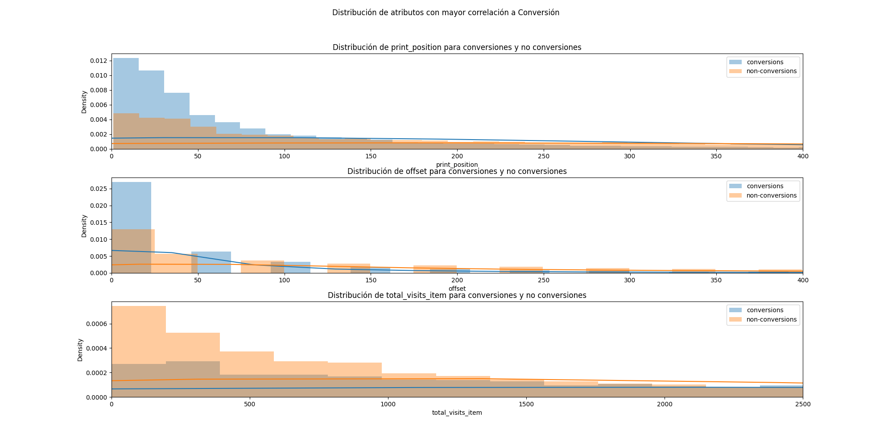
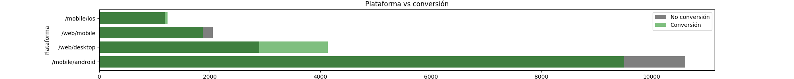

\fontfamily{cmr}
\fontsize{7}{8}
\fontseries{b}
\selectfont

\newpage

## Análisis Exploratorio de los Atributos

Nuestro primera idea para conocer los datos fue observar los valores que tomaba cada atributo. Observamos que había columnas que no tenían variación de los datos, por ejemplo, `accepts_mercadopago`, ya que todos los productos aceptaban mercado pago, o la columna `boosted`, ya que ninguna estaba "boosteada". Mas allá de los posibles atributos de por si solos, buscamos estudiar la correlación y covarianza entre los atributos del dataset y la variable a predecir. En la Figura 1 podemos ver la correlación entre la conversión y cada uno de los atributos, inclusive con los que nuevos atributos que creamos que se explican mas adelante. Con esto pudimos tener una aproximación tentativa a la importancia de los atributos previo a entrenar los modelos.

Luego buscamos ver como eran las distribuciones de algunos de estos atributos con mas correlación.
Tanto el offset como la posición en pantalla en la que esta el producto tienen bastante importancia por sobre la conversión de un usuario. En la Figura 2 podemos observar como a menor cantidad de visitas de un producto es menor la proporción con la que ocurre la conversión contra no conversion, pero a medida que crece la cantidad de visitas, la proporción se equipara. Similar sucede para el offset y print_position, a menor offset o print_position, mayor proporción de conversiones, pero a medida que crecen, las proporciónes se equipars. Nos ideamos estos puntos de inflexión podrían ser posibles cortes para los arboles.

También nos interesó ver como afectaba a la conversión desde que dispositivo ingresaba el usuario a MercadoLibre, en el gráfico de la Figura 3 podemos ver como, sobre una muestra balanceada, en proporción aquellos que entran desde la web tienen un ratio positivo de conversiones mayor que aquellos que entran desde otra plataforma. La única otra plataforma que cumple con esto son los usuarios de iOS pero en menor proporcion.

## Creación de nuevas dimensiones

A partir de la exploración de los atributos, las nuevas columnas que agregamos en nuestro trabajo fueron: En primer lugar creamos nuevas columnas derivadas de algunas ya existentes en el dataset original para obtener información mas detallada de los artículos como por ejemplo: 'discount', 'price_diff', "title_length" y "title_word_count".

#### Polynomial Features

Para capturar relaciones no lineales entre los atributos, por cada atributo especificado en la lista `poly_attrs = ["print_position", "offset", "discount", "price", "health", "original_price"]`, se crea una nueva columna elevando al cuadrado los valores de ese atributo. Los nombres de las columnas siguen el patrón <attr>2 (ej. `price2`). A su vez, para cada par de atributos especificados, se crea tambien la suma de cuadrados dos atributos (por ejemplo, "print_position2 + offset2").

#### Encoding de atributos categóricos

Además, aplicamos Label Encoding a las columnas "platform", "product_id", "domain_id", "logistic_type", "listing_type_id", "free_shipping" y "fulfillment" para convertir los datos categóricos en valores numéricos en nuevas columnas y One Hot Encoding (OHE) a la columna "category_id" para crear representaciones binarias de los datos de categoría. Para aliviar la demanda memoria RAM, se decidió hacer OHE por sobre las 10 categorías más populares y el resto simplemente contaba con todos 0.

#### Imputación de valores faltantes

Se creo una columna `imp_is_pdp` para indicar si la columna `is_pdp` tiene valores faltantes (`NaN`). Además, los valores faltantes en `is_pdp`` se llenan con 0 y luego se convierten a números enteros. Al crear esta columna se noto el primer "salto" en performance, ya que la columna `is_pdp` si es Falsa tiene correlación casi total con la columna a predecir ya que el usuario no pudo haber comprado el producto sin entrar a su página de detalles. Al notar la importancia del dato, una cuestión que se implemento a lo largo de gran parte del desarrollo fue imputar los missings con predicciones de un modelo XGBoost entrenado con los datos que no tenían missings de los datos de Train. Sin embargo el modelo final no cuenta con este método de imputación.

#### Columna "tags"

Observamos que los Tags del producto podían contener información interesante sobre los productos por lo que para cada etiqueta única en la columna `tags` del dataset completo, se crea una nueva columna con el nombre de la etiqueta indicando si el sample contiene el tag o no (estilo OHE). Luego en otra columna llamada "tag_counts" se almacena la cantidad de etiquetas asociadas a cada artículo. En un inicio nos había llamado la atención el atributo original `main_picture` que nos pareció podía llegar a tener impacto sobre la conversión, rápidamente nos dimos cuenta que no estaban disponibles las imágenes, pero al analizar la columna de `tags` en el desarrollo encontramos que unos tags posibles eran "good_quality_picture" y "good_quality_thumbnail" contra "poor_quality_picture" y "poor_quality_thumbnail". De los tags obtuvimos algunas de las features mas importantes como "lightning_deal" o "extended_warranty_eligible".

#### Garantías

Observamos que la columna "warranty" no estaba en un formato consistente. Algunos artículos tenían "Sin garantía" en el texto, mientras que otros tenían "Garantía de fábrica: 12 meses" o "Garantía oficial de 12 meses con la entrega de la correspondiente Factura. Con la compra entregamos Factura A ó B. Locales a la calle en General Rodriguez, Pcia de Buenos Aires. CON LA MARCA", lo que nos indico que fueron ingresados manualmente. Como algunos artículos tenían "Vendedor" o "Fábrica" en el texto de la garantía, mientras que otros no para volver los datos mas uniformes llevamos a cabo un preprocesamiento de la columna `warranty` original, para luego crear nuevas variables representando distintosa aspectos de la garantia de cada artículo. Algunos atributos que rescatamos son si tiene garantía, la longitud en días de la garantía, y si es de fábrica o del vendedor.

#### Fechas

La columna "date" es convertida a un formato "datetime" para poder capturar información sobre aspectos temporales de la misma. De la fecha extrajimos solo el día, mes y día de la semana (1 a 7) para incluir como atributos ya que todo el dataset contaba con fechas entre marzo y abril del mismo año y no contabamos con la hora del día.

#### Representación semantica con Word2Vec

Con el uso de la librería `NLTK`, creamos la columna `tokenized_title` tokenizando la columna "title". Primero usa dividir el texto en oraciones, y luego cada oracion en tokens, resultando es una lista de oraciones tokenizadas. Para generar los embeddings, entrenamos un modelo Word2Vec utilizando los títulos tokenizados. El modelo se configura con hiperparámetros específicos como el tamaño del vector (300 embedings). Para generar una representación semantica sobre los titulos, generamos el atributo `title_embs` que contiene el promedio de todos los embeddings de los títulos tokenizados.

#### Reduccion de dimensionalidad de los Embdedings W2V con PCA

Optamos utilizar PaCMAP con PCA para reducir la dimensionalidad de los embeddings de los titulos. Esto nos permitió entrenar los modelos mas rápido, aunque a la larga notamos que era a cuestas de la performance, por lo que se utilizó para poder evaluar otros atributos mas rapido, pero en el modelo final se utilizó el embedding de 300 dimensiones. Las dimensiones de los embeddings y su dimension reducida por PCA hubieran sido buenos hiperparametros a tunear, pero el entrenamiento de W2V era substancialmente grande como preambulo al entrenamiento de los modelos previos, como tambien lo era el modelo de PaCMAP.

## Armado de conjunto de validación

Inicialmente planteamos dividir el Dataset en 2, un Set de Test y otro de Train, este holdout set era en proporción 25/75. Luego, para poder validar el modelo, separamos un 25% del set de Train para tener un sub_conjunto de validación (SubVal) para entrenar rápido y ver como afectaba al modelo cada cambio hecho a los atributos. Para probar mas a fondo esta ingeniería de atributos detallada previamente, entrenabamos un modelo XGBoost y mediamos su performance haciendo K-Fold Cross Validation con 5 folds sobre el Train Set, si mejoraba, reentrenabamos con todo el Train Set. Una opción que consideramos fue que nuestra validación tenga la misma cantidad de samples que la cantidad de samples de los datos a predecir en Kaggle. En un comienzo nuestro holdout set era 25/75, cuando planteamos esto lo cambiamos a 20/80, con esto logramos que SubVal := 25% de 80% de 100% sea igual cantidad que Test := 20% de 100%. Otra cuestión que consideramos era el desbalance que había en el Dataset respecto a la variable objetivo, ya que en la mayoría de los samples no ocurria la conversión. Para solucionar esto, se planteo utilizar un método de submuestreo aleatorio para reducir la cantidad de muestras de la clase mayoritaria (no vendidos) a la cantidad de muestras de la clase minoritaria (vendidos). Esto se hizo para evitar que el modelo se sobreajuste a la clase mayoritaria y para mejorar el rendimiento del modelo en la clase minoritaria. Sin embargo observamos una performance substancialmente menor en el modelo, por lo que no se utilizó. Alternativamente, implementamos oversamplear la clase minoritaria, pero por los distintos splits que le haciamos a los datasets, sobre todo luego cuando utilizamos K-Fold Cross Validation, no queriamos correr el riesgo de Data Leakage y evitar la repetición de datos en los distintos folds y no se utilizó.

## Modelos
 
### Estimadores Base
Aunque nuestro modelo principal fue un Clasificador de XGBoost, experimentamos con otros estimadores base para poder compararlos con XGBoost y tambien para poder hacer ensambles de modelos.

#### DecisionTrees y RandomForest (RFC)

Inicialmente se probaron modelos de DecisionTrees y RandomForest. Los DecisionTrees se utilizaron solo para hacer un submit inicial y conocer la pipeline de optimización de HyperOpt, sin embargo luego se descartaron. Aunque los Random Forest por si solos no llegaban a tener la performance de XGBoost (~0.83 vs ~0.88), y eran mas lentos para entrenar que XGB cuando la cantidad de atributos crece, se optaron por utilizarlos en los modelos de Ensamble junto a XGBoost y los siguientes modelos.

#### AdaBoost (ABC)

Este clasificador nos resulto en performance ROC_AUC mejor que RandomForest acercandose a XGBoost, pero tomaba casi el doble de tiempo en entrenar que XGB (2' ABC vs 1'22" XGB).

#### HistGradientBoosting (HGB)

Este clasificador nos resulto en performance ROC_AUC mejor que RandomForest los dos modelos anteriores y comparable con XGBoost y por sobre todo, el entrenamiento era mas rápido que XGB (16 segundos HGB vs 1'22" XGB).

### Modelos de Ensamble

#### Average y Voting

Inicialmente para reducir el bias de nuestros modelos hicimos un ensamble promediando las predicciones de distintos modelos. Para ello se implemento la clase `AverageClassifier` que nos permitia a partir de modelos ya entrenados promediar las probabilidades predichas por cada uno de ellos. De por si esto tuvo mejor performance en nuestra validación holdout pero no en el leaderboard. Para poder entrenar los modelos en simultaneo y "compartir" sus predicciones sobre sus entrenamientos, se utilizó la clase `VotingClassifier` de `sklearn`. Luego entonces contabamos con un estimador compuesto por los modelos, lo llamamos Voting(XGB, ABC, HGB, RFC) que nos daba mejor performance que XGB en nuestra validación holdout y tambien en el leaderboard.

#### Stacking

Ademas construimos un modelo que a partir de las predicciones de los modelos anteriores, entrenaba un modelo (hicimos uno con XGBoost y uno con LogisticRegression) con las predicciones de los modelos anteriores como atributos y los mismos labels a predecir, para ello utilizamos la clase StackingClassifier de sklearn, lo llamamos Stack(XGB, ABC, HGB, RFC). El modelo que mejor performance obtuvo en el Leaderboard Público fue un Stack(XGB, ABC, HGB) con un XGBoost como modelo final. Armamos tambien otro StackingClassifier sin RFC para acortar en tiempo de entrenamiento pero su performance fue peor.

#### Ensambles de Ensambles

Otra opción que contemplamos fue promediar las predicciones de los modelos anteriores (Voting(XGB, ABC, HGB, RFC) y Stack(XGB, ABC, HGB, RFC) -> RegLog), a posteriori, este fue nuestro modelo que mejor performance obtuvo en el Leaderboard Privado y fue de los mejores nuestros en el Público.

#### Bagging

Finalmente, la opción por la que optamos fue hacer Bootstrap Aggregating (Bagging) por sobre XGBoost, para ello utilizamos la clase BaggingClassifier de sklearn, y _baggeamos_ 10 estimadores de XGBoost (Mas sobre esta decisión luego), lo llamamos Bagging(XGB). Este fue el modelo que mas tiempo toma en entrenar, ademas fue el que mejor performance obtuvo en nuestra Validación y hasta tuvo una buena performance en el Leaderboard Público y Privado.

## Metodología Búsqueda de Hiperparámetros

En las primeras instancias del desarrollo, optamos por utilizar la librería HyperOpt para el tuneo de Hiperparametros. Lo utilizamos sobre DecisionTrees, RandomForest y XGBoost. Esto podía correr en nuestra máquina por que todavía no contabamos con gran cantidad de atributos (apenas 55). Sin embargo el tuneo no nos resulto en una mejor performance en el Leaderboard, por lo que decidimos replantear la búsqueda de hiperparametros. En las siguientes instancias del desarrollo, optamos por utilizar la librería RandomizedSearchCV, por dos motivos principales: Hiperopt se volvió muy lento en nuestras máquinas (Macbook Pro M1 16GB RAM), y aunque corrimos todo parelelizado (8 cores de la CPU), luego decidimos aprovechar del tiempo de computo de Google Colab sobre una GPU T4 para poder no solo paralelizar si no que entrenar XGBoost con la GPU y tambien HyperOpt, sin embargo Colab cuenta con menos RAM por lo que trabajar con mayor cantidad de atributos sobre Colab fue imposible. A mayor cantidad de atributos la demanda de memoria RAM se disparó (la primera vez que observamos esto fue al hacer OHE sobre Category_ID) y no pudimos seguir trabajando sobre Colab. RandomizedSearchCV entonces nos permitió explorar de forma mas amplia el espacio de hiperparametros (detallados en el Notebook con el código). Por sobre nuestro modelo final de XGBoost hicimos RandomizedSearchCV con 100 fittings que tomo 7hs y la evaluamos sobre un 20% * 80% de Train, esto nos resulto en una performance en nuestra validación de: $0.8918$. Al reentrenar el modelo tuneado con todo el con los 80% de train enteros obtivimos un ROC_AUC de $0.8999$ sobre el otro 20% de Test. Al Baggear 10 estimadores de XGB sin el tuneo de hiperparametros, obtuvimos un ROC_AUC de $0.90159$ con un tiempo de entrenamiento de 24' en nuestra CPU, mientras al baggear 10 estimadores de XGB con los hiperparametros tuneados obtuvimos un ROC_AUC de $0.90146$ con un tiempo de entrenamiento de 1h. Nos hubiera gustado considerar la cantidad de estimadores a baggear como un hiperparametro a optimizar, aunque lo tenemos implementado no lo ejecutamos por su duración.

## Importancia de atributos

A partir de las importancias de los atributos de nuestros modelos (detallados en el Notebook con el código), logramos identificar algunos destacados que sugerimos incluir en el anuncio de venta. Por ejemplo, si un artículo esta catalogado como un "Lightning Deal" o "Deal of the Day" (Promociónes en las que MeLi ofrece participar a sus Sellers) o que el producto ofrezca "Ahora 12" o Garantía Extendida de MeLi impacta sobre la conversión. Por último, si el producto cuenta con un descuento sobre su precio original tambien se podría incluir en un posible anuncio de venta de su producto. Pero por sobre todo, lo que mas impacta es por una lado: la posición en pantalla y cuantas páginas debe recorrer el usuario hasta encontrar el producto, por lo que el vendedor debe esforzarce en lograr buen posicionamiento; por el otro lado, si el usuario entra o no a la Detail Page del Producto, por lo que el vendedor debería buscar que el usuario ingrese a ella. La desventaja que observamos de esto, es que aunque en un estilo de "prior Bayesiano" aquellos usuarios que visitan la Detail Page mayormente compran el producto, no implica que aumentar la cantidad de usuarios que visitan la PDP vaya a aumentar la cantidad de conversiones.
